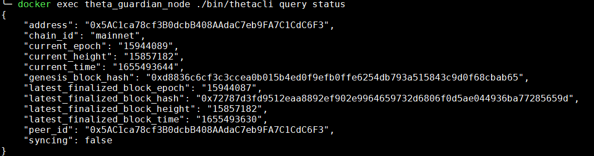
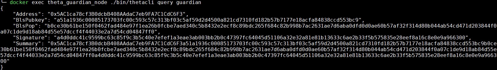

# Additional Commands

As per the [documentation](https://docs.thetatoken.org/docs/running-a-guardian-node-through-command-line#2-launch-the-guardian-node) on the Theta site, you can individually run the commands as we've done in the `get_stake_address.sh` script.

Depending on your installation type, you can execute the commands as follows:

## Docker / Docker-Compose

Query using the `status` command:
> docker exec theta_guardian_node ./bin/thetacli query status

Query using the `guardian` command:
> docker exec theta_guardian_node ./bin/thetacli query guardian

To show a running log and monitor the output of the Guardian node in realtime:

>docker logs -f theta_guardian_node

To show all the Guardian node output and print it in console:
>docker logs theta_guardian_node

## Kubernetes

Query using the `status` command:
> kubectl exec --namespace theta pod/$(kubectl get pod --namespace theta -o jsonpath="{.items[0].metadata.name}") -- ./bin/thetacli query status

Query using the `guardian` command:
> kubectl exec --namespace theta pod/$(kubectl get pod --namespace theta -o jsonpath="{.items[0].metadata.name}") -- ./bin/thetacli query guardian

Some sample output is shown below for the `status/guardian` commands, respectively:

