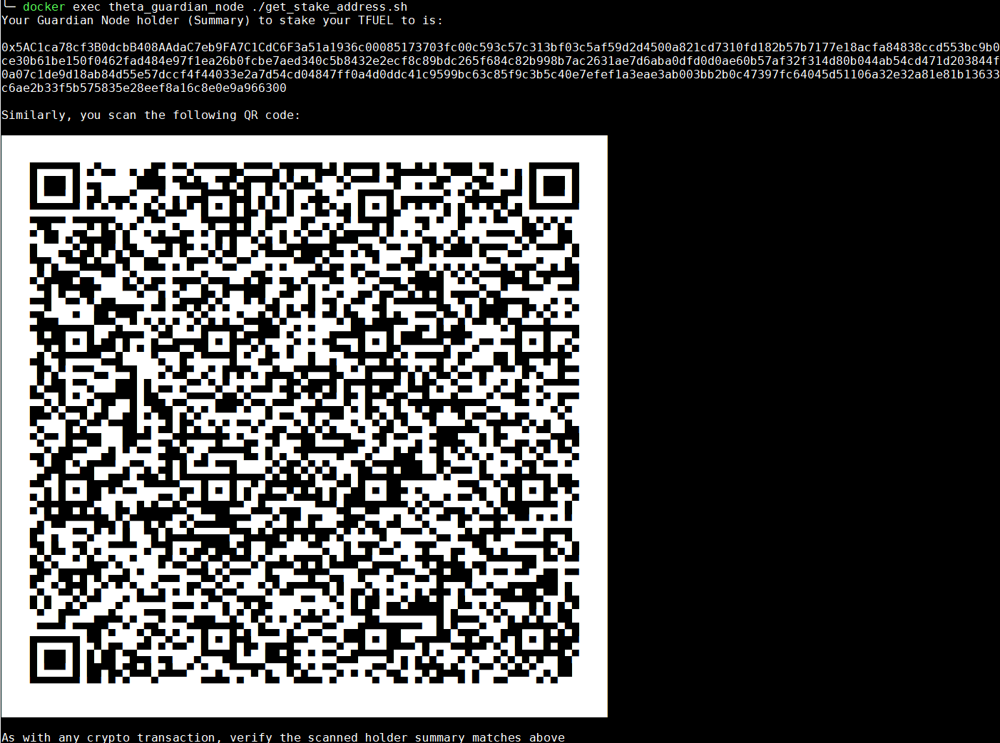
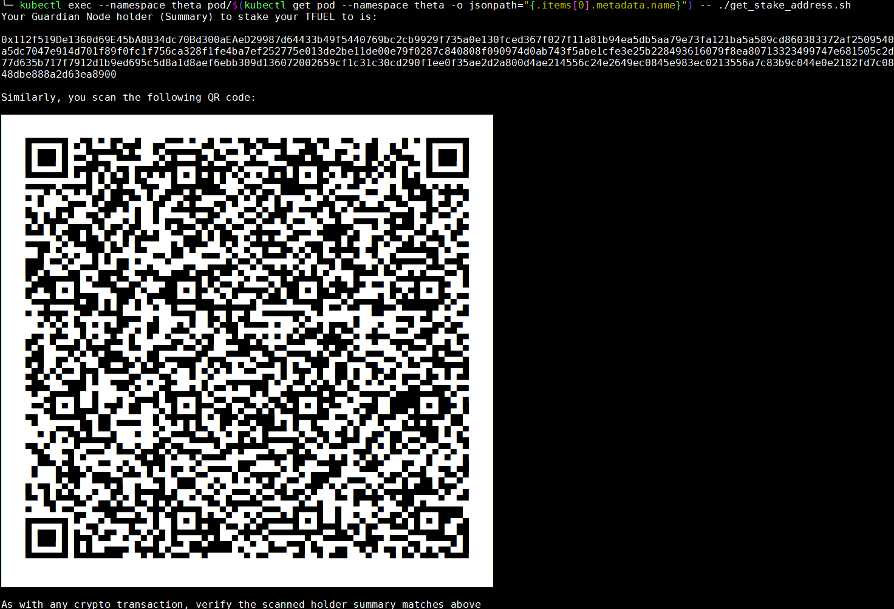

# Staking to your Guardian Node

Now that we have managed to start the Theta Guardian Node in a container, we are nearly ready to begin staking to it.

Once the Guardian Node first starts, it will begin to sync. The sync process takes a bit of time but I have provided a script to make checking/staking a little easier.

The script `get_stake_address.sh` will query the Guardian Node and first check if the syncing has completed. If so, you will be presented with the Guardian Node Holder (Summary) and also a representation of that in QR code form, if you find it easier to scan it.

Follow along below with the installation method you chose prior:

## Docker / Docker-Compose

> docker exec theta_guardian_node ./get_stake_address.sh

Below is example output from a Guardian Node I was testing:

## Kubernetes

> kubectl exec --namespace theta pod/$(kubectl get pod --namespace theta -o jsonpath="{.items[0].metadata.name}") -- ./get_stake_address.sh

Below is example output from the Guardian Node in the cluster I was testing:

That's it for the Guardian Nodes!

Here's the official Theta staking instructions to actually stake your tokens to your new Guardian Node:

https://docs.thetatoken.org/docs/running-a-guardian-node-through-graphical-user-interface#stake-to-the-guardian-node

Note: you just need to follow the "Web Wallet" or "Mobile Wallet" links in the url above.

Enjoy!